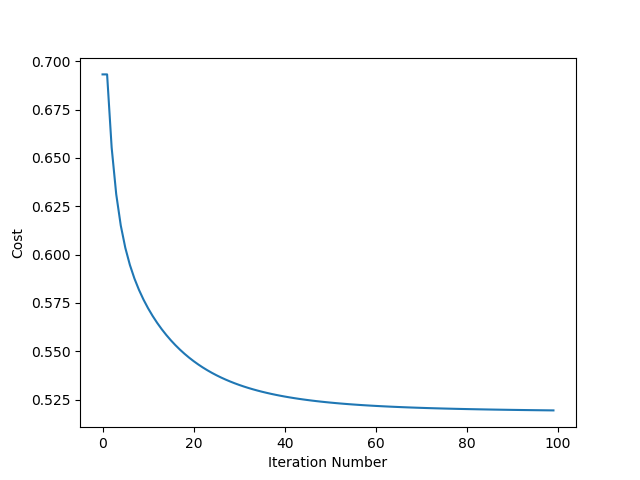

# Logistic Regression Using Gradient Descent

## Class: LogisticRegression

### Parameters:

- learning_rate: int, default: 1

- max_iterations: int, default: 100

### Attributes:

- learning_rate: int

- max_iterations: int

- weights: int

### Methods:

| Method                                  | Description                                                                                                                                                                                                                                                                                                                                                                                                                                                                  |
| --------------------------------------- | ---------------------------------------------------------------------------------------------------------------------------------------------------------------------------------------------------------------------------------------------------------------------------------------------------------------------------------------------------------------------------------------------------------------------------------------------------------------------------- |
| `fit(X, y, initial_weights=None)`       | Fit the model according to given training data                                                                                                                                                                                                                                                                                                                                                                                                                               |
| `predict(X)`                            | Predict class labels for samples in X                                                                                                                                                                                                                                                                                                                                                                                                                                        |
| `score(actual_output, expected_output)` | Get Accuracy Score                                                                                                                                                                                                                                                                                                                                                                                                                                                           |
| `plot_cost_history()`                   | Plot cost history w.r.t. iteration number                                                                                                                                                                                                                                                                                                                                                                                                                                    |
| `__hypothesis(X)`                       |                                                                                                                                                                                                                                                           |
| `__get_cost(X, y)`                      |  |
| `__fsmn(data)`                          | Feature Scaling and Mean Normalisation                                                                                                                                                                                                                                                                                                                                                                                                                                       |


### Example:

**Entire class implementaion and main function is in [demo.py](./demo.py)**

#### Data: Loan Prediction

Motive: To check if loan will be paid or not

| Attributes | Description |
|--|---|
|Gender | Male: 1, Female: 0 |
| Married| Married: 1, Un-Married: 0|
| Dependents| No. of Dependents|
| Education| Educated: 1, Un-Educated: 0 |
|Self_Employed| Self Employed: 1, Not Self Employed: 0|
|ApplicantIncome| Applicant's Income|
|CoapplicantIncome| Co-applicant's Income|
|LoanAmount| Loan Amount|
|Loan_Amount_Term| Loan Term in days |
|Credit_History| Credit History |
|Property_Area| No. of Property Owned |
| Loan_Status | Paid: 1, Unpaid: 0 |


#### Main Function:

```python
data = np.genfromtxt('train.csv', delimiter=',')
data = data[1:]
train_len = int(len(data) * 0.70)
train_data = data[:train_len]
test_data = data[train_len:]
clf = LogisticRegression()
clf.fit(train_data[:, :-1], train_data[:, -1])
y = clf.predict(test_data[:, :-1])
print("Accuracy:", clf.score(y, test_data[:, -1]))
clf.plot_cost_history()
```

#### Output:

```Accuracy: 0.789189189189```


